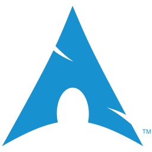

### Hello! I'm Gabriel Scaranello

I'm a programming lover, I've been working in the area since January 2018.  
On my journey I learned and used PHP, followed by JavaScript and TypeScript, using frameworks like Laravel and Vue.js. I'm currently a front-end developer using Vue.js and React, and I venture a lot with Node.js.  
Contact me to talk about programming, I'm a fan of a good challenge and a good Counter-Strike game.

 
  <picture>
    <source media="(prefers-color-scheme: dark)" srcset="https://github-readme-stats.vercel.app/api?username=gabrielscaranello&show_icons=true&bg_color=00000000&text_color=cad3f5&icon_color=c6a0f6&title_color=8bd5ca&count_private=true" />
    <source media="(prefers-color-scheme: light)" srcset="https://github-readme-stats.vercel.app/api?username=gabrielscaranello&show_icons=true&bg_color=00000000&text_color=4c4f69&icon_color=8839ef&title_color=179299&count_private=true" />
    
  </picture>
  
  <picture id="haha">
    <source media="(prefers-color-scheme: dark)" srcset="https://github-readme-stats.vercel.app/api/top-langs/?username=gabrielscaranello&langs_count=6&layout=compact&hide=C%23&bg_color=00000000&text_color=cdd6f4&icon_color=cba6f7&title_color=94e2d5&count_private=true" />
    <source media="(prefers-color-scheme: light)" srcset="https://github-readme-stats.vercel.app/api/top-langs/?username=gabrielscaranello&langs_count=6&layout=compact&hide=C%23&bg_color=00000000&text_color=4c4f69&icon_color=8839ef&title_color=179299&count_private=true" />
    
  </picture>

### Languages

    
    
    
    
    
    

### Frameworks

    
    <picture>
        <source media="(prefers-color-scheme: dark)" srcset="./assets/icons/quasar-dark.svg" />
        <source media="(prefers-color-scheme: light)" srcset="./assets/icons/quasar.svg" />
       
    </picture>
    
    
    
    

### Tecnologies

    
    
    
    
    
    
    

##

  
  
  
  

 
  
<picture>
  <source media="(prefers-color-scheme: dark)" srcset="https://github.com/gabrielscaranello/gabrielscaranello/blob/output/github-contribution-grid-snake-dark.svg" />
  <source media="(prefers-color-scheme: light)" srcset="https://github.com/gabrielscaranello/gabrielscaranello/blob/output/github-contribution-grid-snake.svg" />
  
</picture>
  
##### More

- 📍 I'm from: Brazil
- 🎂 Age: 24 years old
- 💻️ OS: Arch Linux
- 🌐 Favorite Languages: JavaScript/TypeScript
- 🔧 Favorite Frameworks: Vue.js, Quasar, NestJs

#### Links

- [Dotfiles](https://github.com/gabrielscaranello/dotfiles)
- [AstroNvim Config](https://github.com/gabrielscaranello/astronvim-config)
